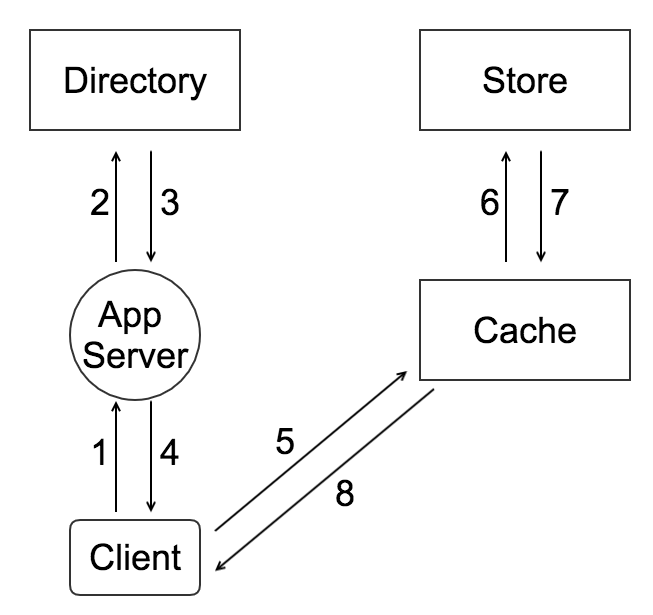

# OnyxiaFS

A distributed object file system inspired by the paper [Beaver](https://www.usenix.org/legacy/event/osdi10/tech/full_papers/Beaver.pdf) which was published by Facebook Inc. at 2010.

## Components

### OnyxiaGateway

The gateway of services.

### OnyxiaDirectory

#### Fore Main Functions

1. Provides a mapping from logical volumes to physical volumes. Web servers use this mapping when uploading photos and also when construcing the image URLs for a page request.
2. Load balances writes across logical volumes and reads across physical volumes.
3. Determines whether a photo request should be handled by the CDN or by the Cache. This functionality lets us adjust our dependence on CDNs.
4. Identifies thoes logical volumes that are read-only either because of operational reasons or because those volumes have reached thir storage capacity.

### OnyxiaCache

The Cache who receives HTTP requests for photos from CDNs and also directly from users' browser is a distributed hash table and use a photo's id as the key to locate cached data. If the Cache cannot immediately respond to the request, then the Cache fetches the photo from the Store machine identified in the URL and replies to either the CDN or the user's browser as appropriate.

### OnyxiaStore

Each Store machine managese multiple physical volumes. Each volume holds millions of photos. For concreteness, the reader can think of a physical volume as simply a very large file (100 GB) saved as '/onyxia/\<logical volume id\>'. A Store machine can access a photo quickly using only the id of the corresponding logical volume and the file offset at which the photo resides. This knowledge is the keystone of the design: retrieving the filename, offset and size for a particular photo without needing disk operations.

## Architecture

